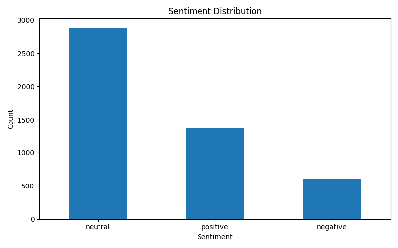
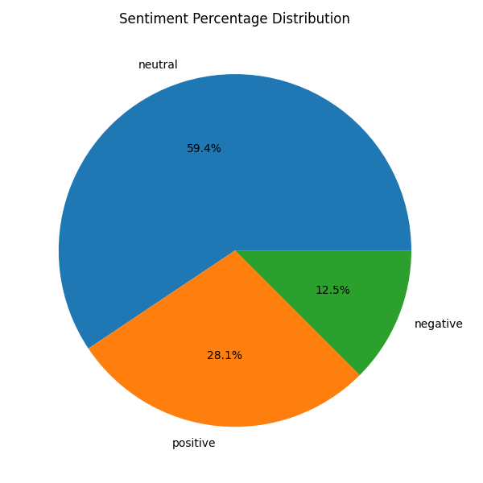

# AI-Powered Market Trend & Consumer Sentiment Forecaster

## Milestone 1 – Data Ingestion & Storage Pipeline

### Overview
This project builds a backend data pipeline that collects market-related news data, cleans and structures it, exports to CSV, and stores it in MongoDB for further analysis.

### Implemented Modules

1. Data Collection Module (news_api.py)
   - Simulated news data ingestion
   - Structured article metadata

2. Data Cleaning Module (cleaner.py)
   - Text normalization
   - Noise removal
   - Lowercase standardization

3. Data Pipeline Controller (main.py)
   - End-to-end orchestration
   - CSV export
   - MongoDB insertion

4. Database Integration (mongo_db.py)
   - MongoDB connection
   - Document insertion
   - Timestamp tracking

### Tech Stack
- Python 3.12
- Pandas
- MongoDB
- PyMongo
- Git & GitHub

### Architecture Flow
Data Source → Cleaning → Structuring → CSV → MongoDB Storage

### Status
Milestone 1 Completed  
Ready for Sentiment Analysis Integration
## 📊 Sentiment Analytics Dashboard

### Bar Chart

### Pie Chart

## 🤖 Milestone 2 – Sentiment Prediction Model

- TF-IDF vectorization
- Logistic Regression classifier
- Train/Test split
- Model evaluation (Accuracy, Precision, Recall, F1-score)
- Model persistence using Joblib
